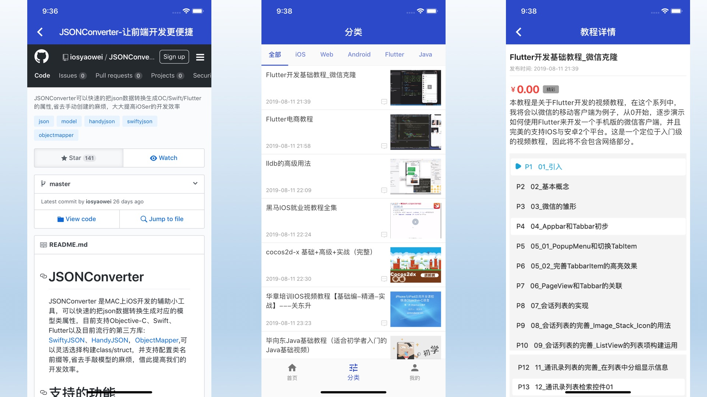
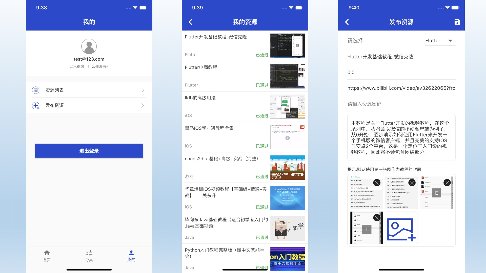
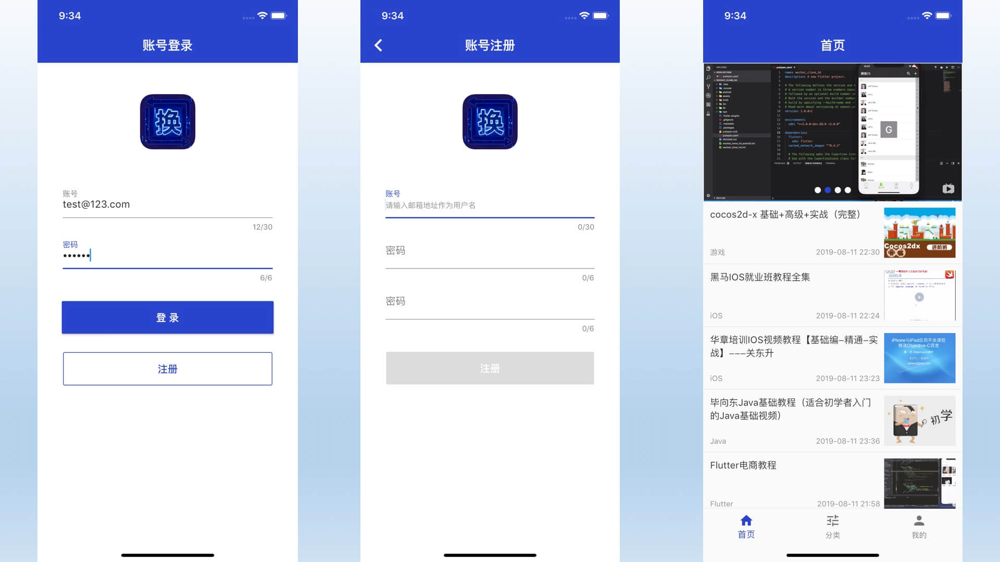
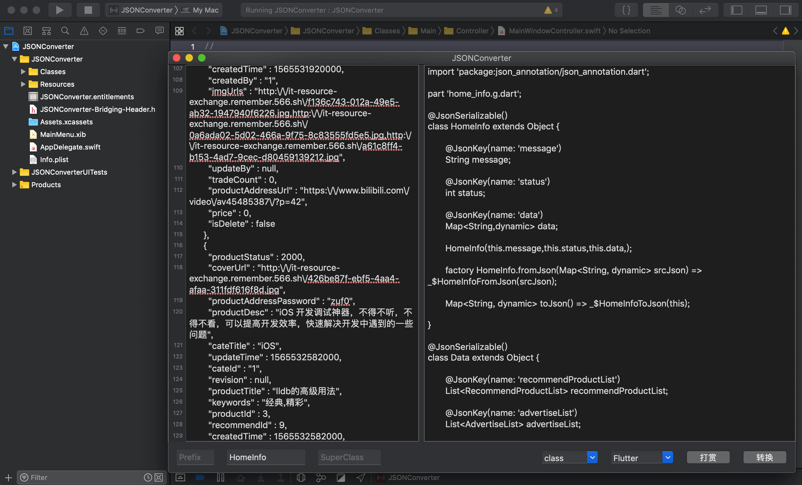

致力于打造，
《IT换换》采用免费开源且跨平台的移动应用开发引擎Flutter开发，是一款完全开源、跨平台的一个资源共享社区APP，目前项目还是初期阶段，项目搜集全网的精品资源教程，进行筛选分类，让用户可以快速找到自己中意的教程。（可以快速导出android版本、iOS版本）

## 先上图






## 项目结构
```
├── common - 一些通用的常量定义
├── model - 项目中使用的后台返回的数据模型
├── net - 基于dio的网络请求封装
│   └── interceptors - 网络请求的拦截器
├── pages  - 页面
│   ├── classify - 分类页面
│   ├── create - 资源创建编辑页面
│   ├── detail - 资源详情页面
│   ├── home - 首页
│   ├── login - 登录注册页面
│   ├── my_product_list - 我发布资源列表页面
│   ├── profile - 个人中心页面
│   └── web - web页面
├── route - 基于fluro的路由
├── utils - 项目中使用的工具类
├── vo - 前端页面组合的VO
└── widgets - 一些通用Widget
```

## JSON 数据解析
项目开发过程中，使用json_serializable，但在编写模型的时候依然较为繁琐，索性在之前[JSONConverter](https://github.com/iosyaowei/JSONConverter)添加了对Flutter的支持。
JSONConverter 是MAC上iOS开发的辅助小工具，可以快速的把JSON数据转换生成对应的模型类属性，目前支持Objective-C、Swift、Flutter以及目前流行的Swift第三方库: [SwiftyJSON](https://github.com/SwiftyJSON/SwiftyJSON)、[HandyJSON](https://github.com/alibaba/HandyJSON)，[ObjectMapper](https://github.com/Hearst-DD/ObjectMapper),可以灵活选择构建class/struct，并支持配置类名前缀等,省去手敲模型的麻烦，借此提高我们的开发效率。



## 待完成事项
1. 用户注册的邮箱验证码功能
2. 资源评论功能
3. 基于微信的资源详情H5分享
4. 收藏功能

## 第三方声明
*  cached_network_image: ^1.1.0
*  pull_to_refresh: ^1.3.3
*  dio: ^2.1.1
*  shared_preferences: ^0.4.2
*  connectivity: ^0.4.3+6
*  event_bus: ^1.1.0
*  json_annotation: ^2.0.0
*  intl: ^0.15.8
*  flutter_spinkit: "^3.1.0"
*  oktoast: ^2.1.9
*  image_picker: ^0.6.0+10
*  multi_image_picker: ^4.5.1
*  flutter_webview_plugin: ^0.3.5
*  flutter_swiper : ^1.1.6
*  fluro: "^1.5.1"

感谢以上库开发者的分享

## 开源协议说明
- [Lab: Write your first Flutter app](https://flutter.io/docs/get-started/codelab)
- [Cookbook: Useful Flutter samples](https://flutter.io/docs/cookbook)

For help getting started with Flutter, view our 
[online documentation](https://flutter.io/docs), which offers tutorials, 
samples, guidance on mobile development, and a full API reference.
